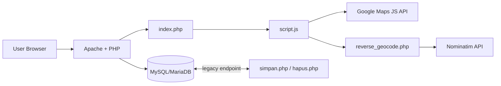
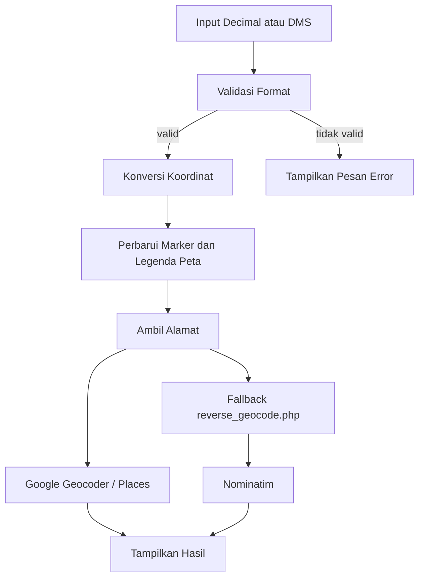
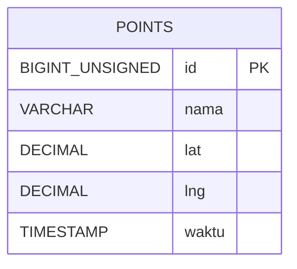

# 3. Arsitektur Sistem

## 3.1 Arsitektur Tingkat Tinggi
Aplikasi menggunakan pola server-rendered PHP dengan JavaScript client-side.

## 3.2 Alur Konversi dan Alamat

## 3.3 Komponen Utama
- `index.php`
  - Render UI dan injeksi konfigurasi JavaScript.
  - Menampilkan area peta, input konversi, dan hasil.
- `script.js`
  - Parser/validator input.
  - Konversi Decimal <-> DMS.
  - Inisialisasi peta, marker drag-and-drop, klik peta.
  - Integrasi reverse geocoding.
- `database.php`
  - Deteksi mode lingkungan (`LOCALHOST`/`HOSTING`).
  - Konfigurasi DB/API dari environment variable.
  - Helper CSRF dan security headers.
- `reverse_geocode.php`
  - Endpoint fallback alamat server-side.
  - Validasi input `lat/lng` dan response JSON.
- `simpan.php`, `hapus.php` (legacy)
  - Endpoint mutasi data titik yang dilindungi CSRF.

## 3.4 ER Diagram

## 3.5 Keamanan Arsitektur
- CSRF token untuk endpoint POST.
- Validasi input di frontend dan backend.
- Prepared statement PDO (anti SQL injection).
- Security headers (`X-Frame-Options`, `X-Content-Type-Options`, dll).
