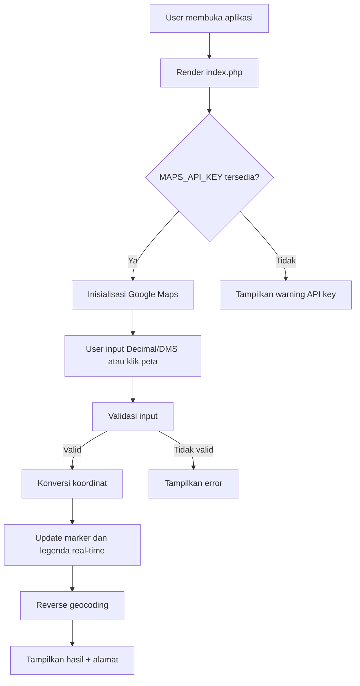
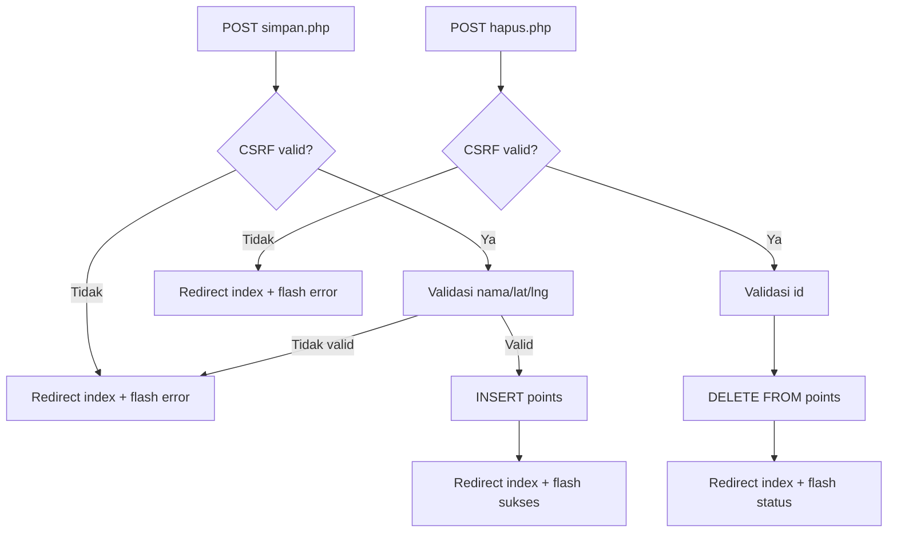

# 3. Arsitektur Sistem

## 3.1 Gambaran Umum
BedadungPoint menggunakan arsitektur web sederhana:
- **Presentation Layer**: `index.php`, `script.js`, CSS inline
- **Application Layer**: logika konversi, validasi input, interaksi peta
- **Integration Layer**: Google Maps JS API + Geocoder
- **Data Layer (legacy)**: MySQL tabel `points`

## 3.2 Flowchart Alur Utama


## 3.3 Flowchart Endpoint Legacy Data


## 3.4 ER Diagram (Legacy Database)
```mermaid
erDiagram
    POINTS {
        BIGINT UNSIGNED id PK
        VARCHAR nama
        DECIMAL lat
        DECIMAL lng
        TIMESTAMP waktu
    }
```

## 3.5 Komponen Utama
### `index.php`
- Menyusun layout UI.
- Menyuntikkan konfigurasi global JS (`hasMapsApiKey`, `defaultCenter`).
- Menampilkan header/footer dan area map + konversi.

### `script.js`
- Parser/validator Decimal dan DMS.
- Konversi dua arah Decimal <-> DMS.
- Inisialisasi peta, marker drag-and-drop, click-to-set-point.
- Update legenda koordinat real-time.
- Reverse geocoding alamat.
- Copy hasil ke clipboard.

### `database.php`
- Deteksi environment lokal vs production.
- Koneksi PDO untuk endpoint legacy.
- CSRF helper dan security headers.
- Definisi konstanta `MAPS_API_KEY`.

### `simpan.php` & `hapus.php` (Legacy)
- Endpoint mutasi data titik.
- POST-only + CSRF + prepared statements.

### `.htaccess`
- URL canonical tanpa `index.php`.
- Front-controller fallback.
- Mendukung base URL root maupun subfolder.
