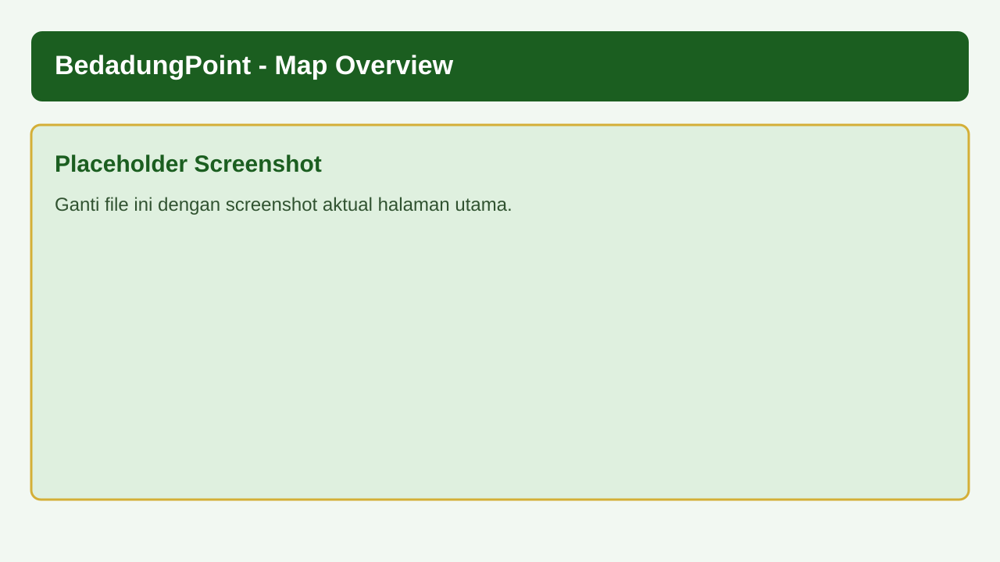
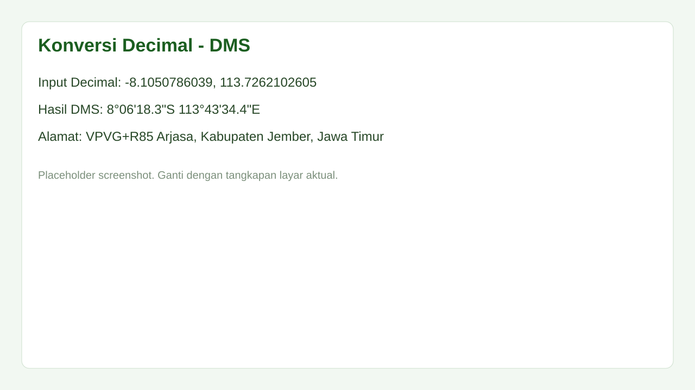
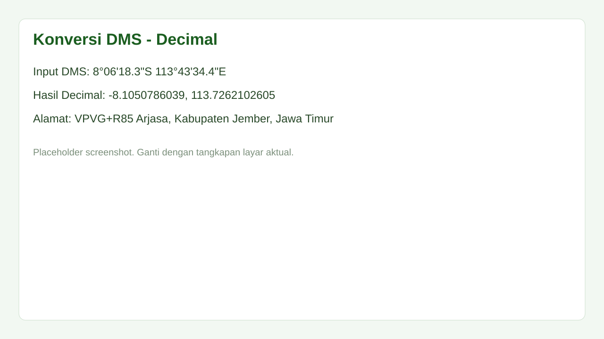
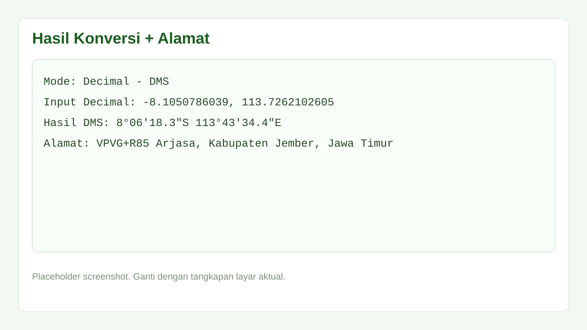
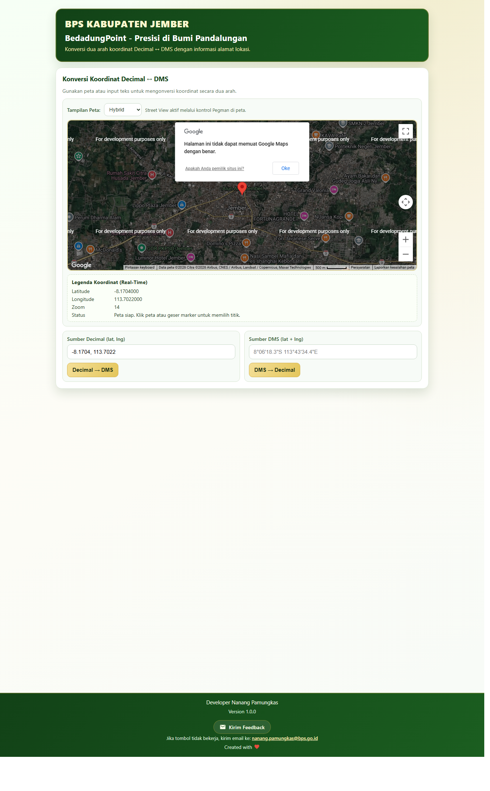
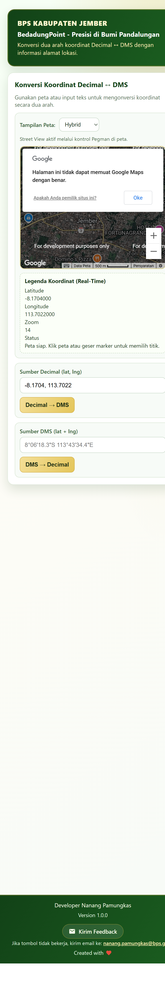

# 5. Panduan Penggunaan Fitur Utama

## 5.1 Ringkasan Tampilan
Halaman utama berisi:
- Header identitas aplikasi.
- Peta interaktif untuk memilih titik.
- Form konversi Decimal dan DMS.
- Panel hasil konversi dan alamat.

## 5.2 Input Titik dari Peta
1. Klik titik pada peta.
2. Marker berpindah ke titik klik.
3. Nilai koordinat terisi otomatis ke input decimal.
4. Legenda koordinat berubah real-time.

## 5.3 Konversi Decimal ke DMS
1. Isi kolom `Sumber Decimal (lat, lng)`.
2. Klik tombol `Decimal -> DMS`.
3. Sistem menampilkan mode, input, hasil DMS, dan alamat.

## 5.4 Konversi DMS ke Decimal
1. Isi kolom `Sumber DMS (lat + lng)`.
2. Klik tombol `DMS -> Decimal`.
3. Sistem menampilkan hasil decimal dan alamat.

## 5.5 Copy Hasil
1. Klik tombol `Copy Hasil`.
2. Paste hasil ke editor/spreadsheet.
3. Jika clipboard API diblokir browser, lakukan salin manual dari area hasil.

## 5.6 Penggunaan Peta
- Gunakan klik peta untuk pilih titik.
- Gunakan drag marker untuk presisi.
- Gunakan zoom control untuk skala detail.
- Street View dapat digunakan lewat kontrol bawaan Google Maps jika tersedia.

## 5.7 Fitur Feedback
Pengguna dapat mengirim masukan melalui tautan `mailto` di bagian footer/header (tergantung implementasi UI yang aktif pada rilis).

Desktop:

Mobile:

## 5.8 Format Input
Decimal contoh:
- `-8.1050786039, 113.7262102605`

DMS contoh:
- `8°06'18.3"S 113°43'34.4"E`

## 5.9 Catatan Operasional
- Gunakan tanda titik (`.`) untuk angka desimal.
- Pastikan latitude/longitude dalam rentang valid.
- Jika alamat tidak muncul, lihat panduan `docs/07-troubleshooting.md`.
